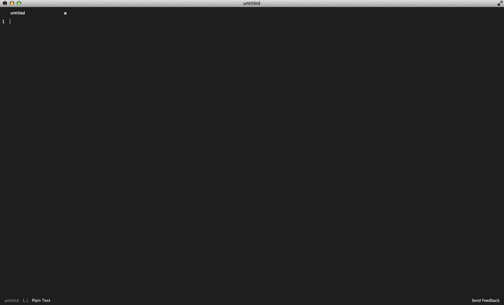
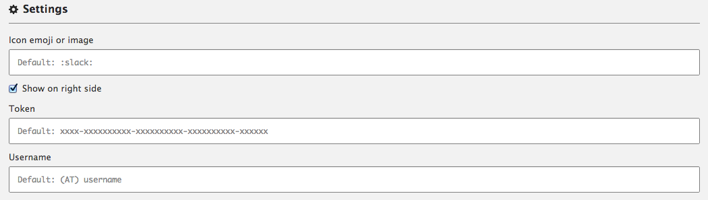

# Slack Chat - Atom package *Beta*

Slack Chat is an Atom package that integrates the slack messaging client into the editor.
#### With slack chat you can: 
- Send messages
- View message history

# Preview

# Todo
- Parse markdown
- Enable links
- Display images
- Display emoticons
- Automatically scroll to new messages
- More responsive message input
- Notifications for new messages
- Receive messages in real time
- More customization on placement and theme of Slack Chat
- Make the commands less buggy

# Usage

### Icon emoji or image
Select he emoji or image that will be seen by others as your icon.
### Token
This is your token for your team. You can acquire a token under authentication here https://api.slack.com/ 
### Username
The slack api doesn't operate as the user who is sending requests but as a bot that is sending 
requests on behalf of the user. For this reason, you'll need to specify a username to be used.
If you use the same username as you have specified on Slack, you will see your username show up as
"*\#{username} (bot)*". "(bot)" will not appear if your username is not the same as your Slack username.
